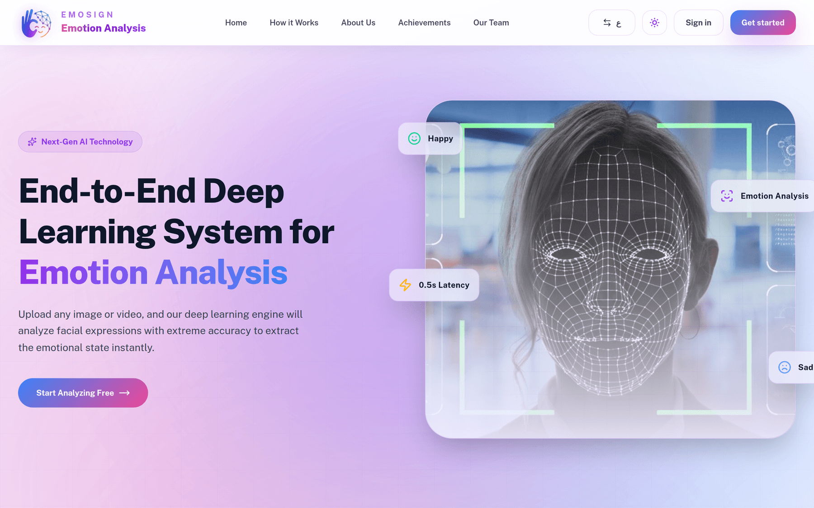
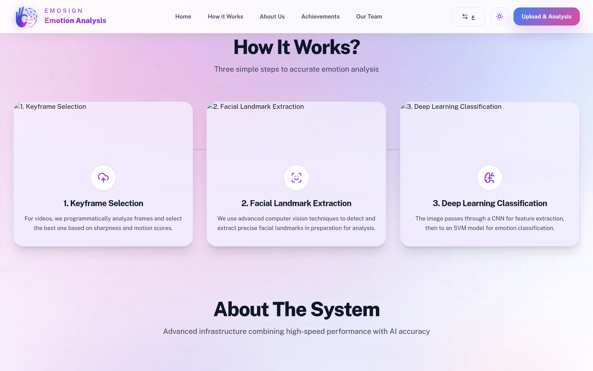
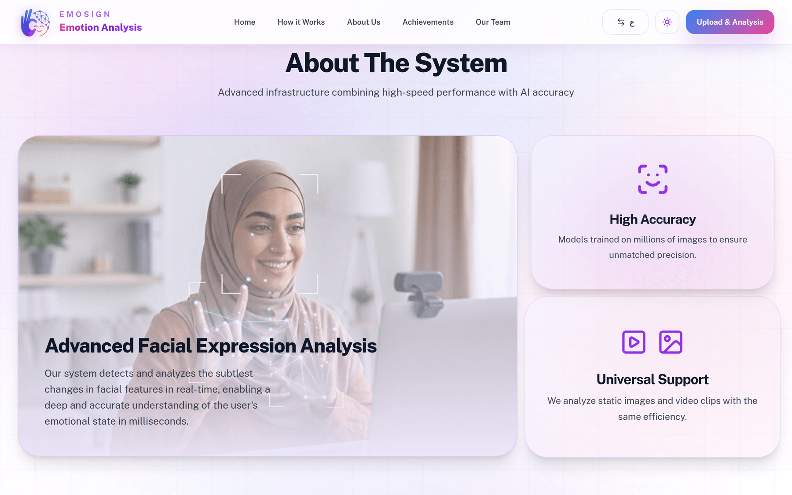
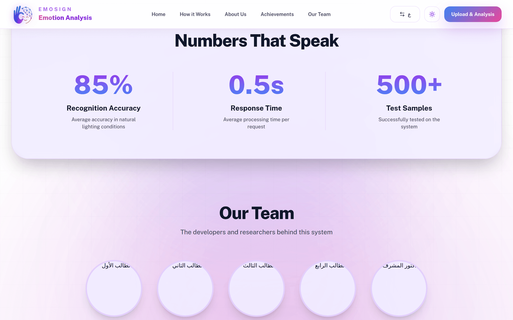
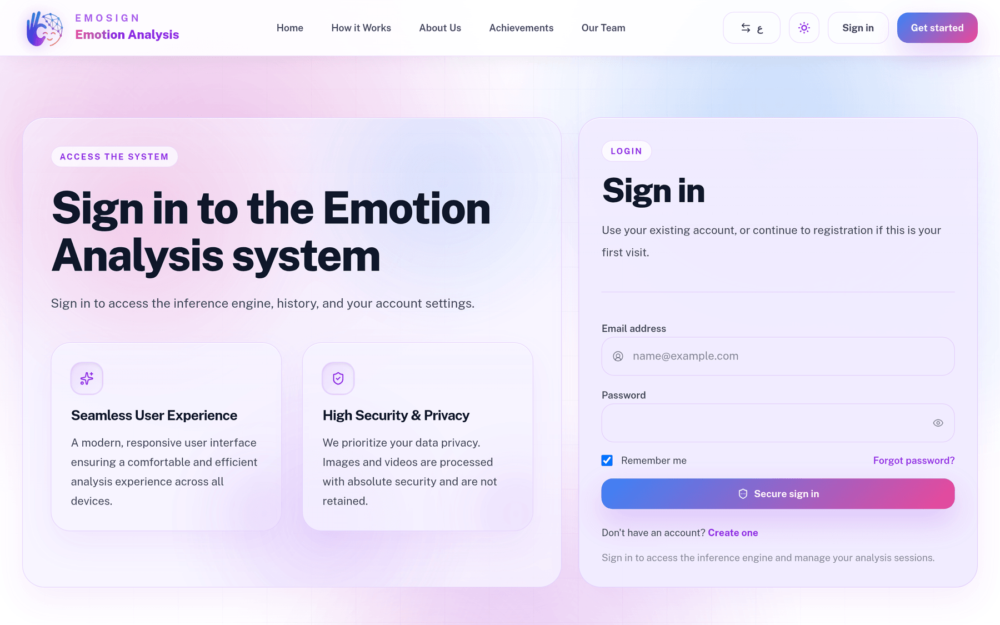
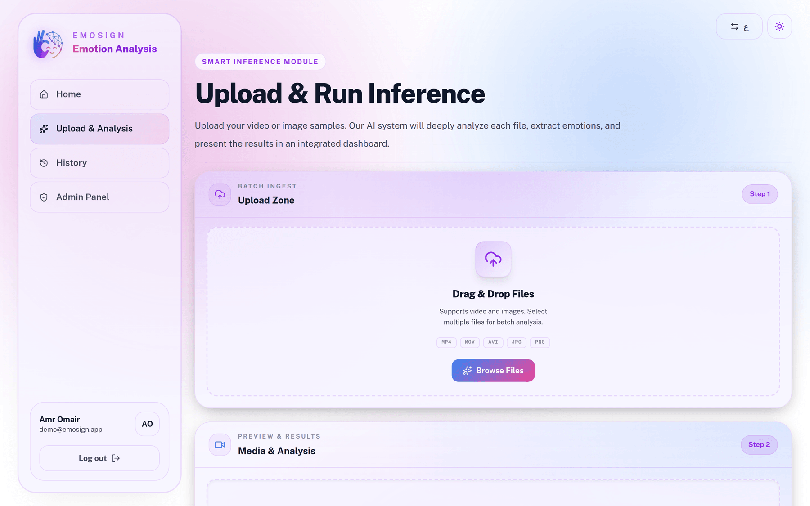
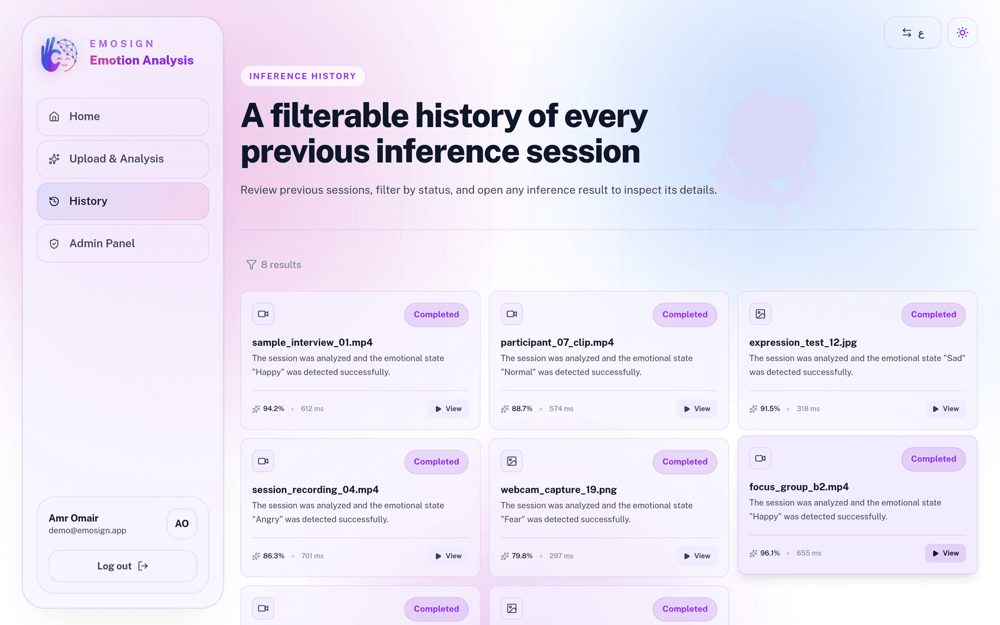
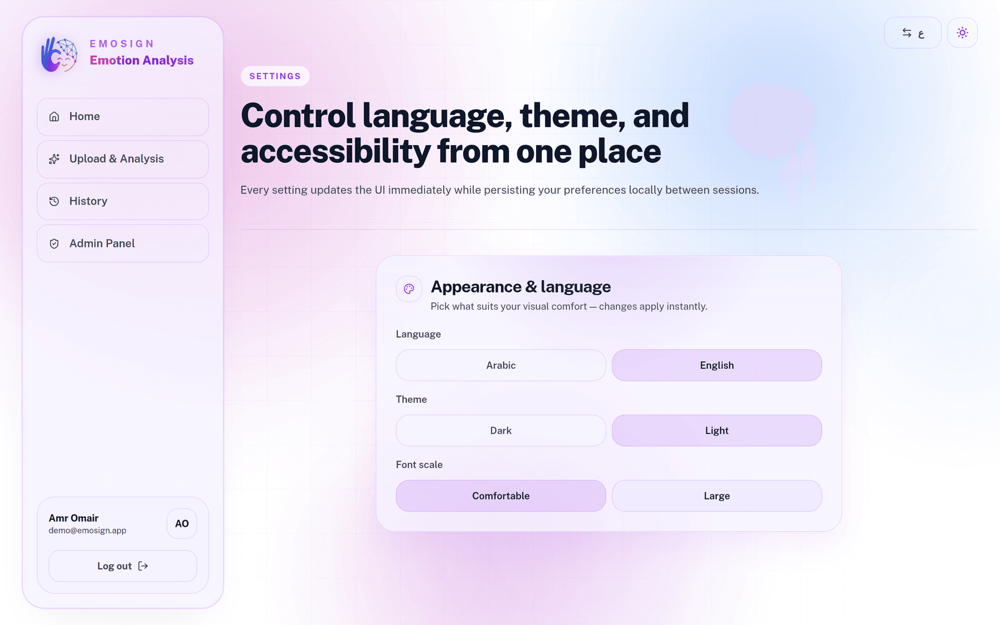
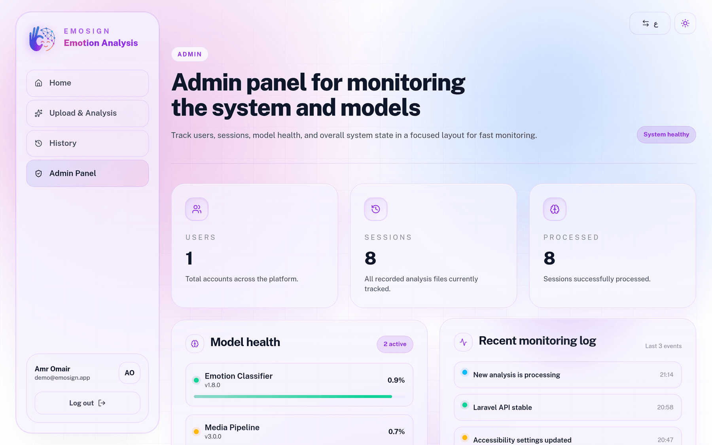
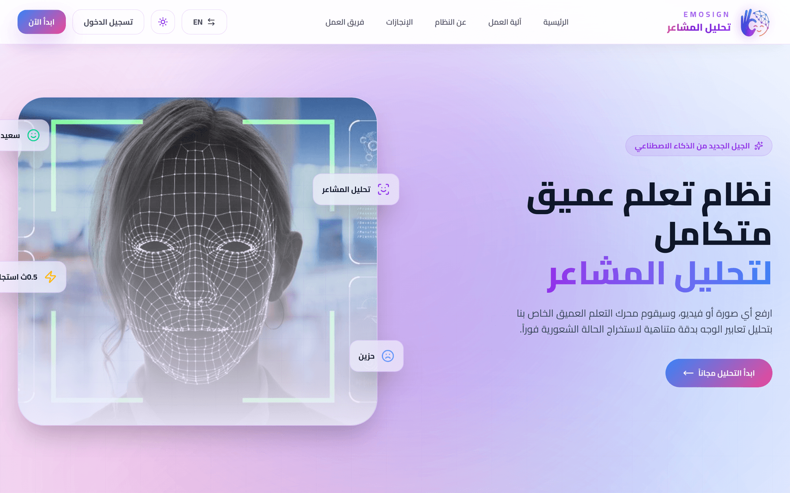

<h1 align="center">EmoSign</h1>

<p align="center">
  <strong>End-to-end deep learning system for facial emotion analysis</strong><br>
  Upload an image or a video, and the system selects the clearest frame, isolates the face,
  extracts a deep feature vector, and classifies the emotional state — with a full
  upload, history and monitoring workflow around it.
</p>

<p align="center">
  
  
  
  
  
  
  
</p>



---

## Project context

This is the engineering side of **"End-to-End Deep Learning System for Sign Language and Emotion
Classification"**, a graduation project at the Faculty of Information Technology and Artificial
Intelligence, Palestine Technical University - Kadoorie. The project was selected under the
**PalUROP Undergraduate Research Support Program** and awarded a research grant.

Supervised by Dr. Hadi Khalilia, with co-supervision from Dr. Andrea Bontempelli
(University of Trento, Italy). Team: Baraa Mohammad, Jenan Ruziqat, Amro Omair, Anas Maali.

This repository holds the **emotion classification pipeline and the full-stack platform** built
around it - the FastAPI inference service, the computer-vision preprocessing, the trained model
artifacts, and the Laravel + React application. The sign-language recognition track is maintained
separately and is not included here.

---

## Results

The committed model classifies five emotional states. These figures come from
`python-api/models/emotion/emotion_training_report.json`, generated on a held-out test split.

**Overall accuracy: 91.85%** — 2,514 samples of 1,280 features, split 2,011 train / 503 test.

| Class | Precision | Recall | F1 | Support |
|---|---|---|---|---|
| angry | 0.910 | 0.827 | 0.866 | 98 |
| fear | 0.941 | 0.931 | 0.936 | 102 |
| happy | 0.865 | 0.941 | 0.901 | 102 |
| normal | 0.942 | 0.960 | 0.951 | 101 |
| sad | 0.939 | 0.930 | 0.935 | 100 |
| **macro avg** | **0.919** | **0.918** | **0.918** | **503** |

Throughput, measured over a 411-file batch run (`python-api/runtime/reports/emotion-all/summary.json`):
411 of 411 files processed successfully, **127 ms average** per file (min 109 ms, max 495 ms).

---

## How it works



**1 · Keyframe selection.** For video input, frames are scored on sharpness (variance of Laplacian)
and inter-frame motion. Blurred and low-information frames are rejected, and the best candidates are kept.

**2 · Face isolation and enhancement.** MediaPipe selfie segmentation removes the background, and a
natural-enhancement pass normalises lighting before feature extraction.

**3 · Feature extraction and classification.** Each prepared frame goes through **EfficientNet-B0**
(ImageNet weights, classifier head replaced with `Identity`) to produce a 1,280-dimension vector.
Frame vectors are pooled, standardised with `StandardScaler`, and classified by an **RBF SVM**.

### Request flow

```
Browser ──upload──▶  Laravel 12  ──bytes──▶  FastAPI :8001  POST /predict
                         │                        │
                         │                        ├─ keyframe selection (sharpness + motion)
                         │                        ├─ background segmentation (MediaPipe)
                         │                        ├─ EfficientNet-B0 → 1280-d vector
                         │                        └─ StandardScaler → RBF SVM
                         │                        │
                         ◀── emotion · confidence · top-N alternatives · latency ──┘
                         │
                         └──▶ MySQL  (media bytes, result, latency, frames analysed)
                                   │
                                   └──▶ dashboard · history · admin panel
```

### Inference API

| Method | Endpoint | Purpose |
|---|---|---|
| `GET` | `/health` | Service liveness |
| `GET` | `/info` | Loaded model, classes and version |
| `POST` | `/predict` | Image or video upload → emotion prediction |
| `POST` | `/predict/emotion/vector` | Prediction from a pre-extracted feature vector |
| `POST` | `/predict/batch` | Multiple files in one request |





---

## The application

### Authentication

Session-based auth with role separation — standard users see only their own sessions, admins see the whole platform.




### Upload and run inference

Drag-and-drop or browse, with multi-file batch selection. Accepts MP4, MOV, AVI, JPG and PNG.
Media preview and analysis results appear side by side as each file is processed.



### Inference history

Every session is stored with its predicted emotion, confidence, frames analysed and processing
latency — filterable by status, and openable to inspect the full result with its alternatives.



### Settings

Language, theme and accessibility controls, applied live and persisted per user between sessions.



### Admin panel

Platform-wide counts, per-model health with version numbers, and a recent monitoring log.



### Bilingual by design

The whole interface mirrors between English and Arabic, including layout direction and typography —
Cairo, Almarai and Noto Kufi Arabic for Arabic, Public Sans for Latin.



---

## Tech stack

| Layer | Technology |
|---|---|
| Backend | Laravel 12 — routing, session auth, uploads, persistence |
| Frontend | React 19, TypeScript, Vite, React Router, Tailwind CSS 4, Framer Motion |
| Inference service | FastAPI + Uvicorn |
| Feature extraction | PyTorch / torchvision — EfficientNet-B0 |
| Computer vision | OpenCV, MediaPipe (selfie segmentation) |
| Classifier | scikit-learn — RBF SVM with `StandardScaler` |
| Database | MySQL — media bytes and analysis records stored together |

---

## Running it locally

Two services: the Laravel web app and the Python inference API.

### 1 · Laravel application

```bash
git clone https://github.com/3mora-A/Emosign.git
cd Emosign

composer install
cp .env.example .env
php artisan key:generate
```

Set your database credentials in `.env`, then:

```bash
php artisan migrate
php artisan storage:link
```

### 2 · Frontend assets

```bash
npm install
npm run dev        # or: npm run build
```

### 3 · Python inference service

```bash
cd python-api
python -m venv venv
source venv/bin/activate          # Windows: .\venv\Scripts\Activate.ps1
pip install -r requirements.txt
python main.py
```

FastAPI starts on port `8001`, which is where the Laravel upload controller sends media.

### 4 · Serve the app

```bash
php artisan serve
```

---

## Command-line utilities

From `python-api/`:

```bash
python scripts/predict_emotion.py --sample-index 0
python scripts/batch_predict_emotion.py "../path/to/media" --recursive
python scripts/train_emotion_model.py
python scripts/test_emotion_model.py
python scripts/extract_frames.py
```

`batch_predict_emotion.py` writes three files into `runtime/reports/`: `predictions.csv` (one row per
file), `predictions.json` (full per-file detail with top predictions) and `summary.json` (aggregate
counts, timing and evaluation metrics). Ground-truth labels can be sourced with
`--label-source parent-dir`, `filename-prefix` or `manifest`.

---

## Project structure

```
app/  routes/  database/                     Laravel application
resources/js/app/                            React pages, components, client state
resources/views/                             Blade shell for the SPA

python-api/main.py                           FastAPI inference server
python-api/emotion/extractor.py              Keyframe selection, segmentation, EfficientNet features
python-api/emotion/model.py                  Model and label-encoder loading
python-api/models/emotion/                   Trained artifacts and training report
python-api/models/emotion/vectors/           X.npy, y.npy feature vectors and label map
python-api/scripts/                          Train, test, predict, batch and frame-extraction tools
python-api/runtime/reports/                  Generated batch reports

screenshots/                                 Interface screenshots used in this README
```

---

## Model artifacts

Everything needed to reproduce or re-train is committed:

| File | Contents |
|---|---|
| `models/emotion/emotion_model.pkl` | Trained `StandardScaler` + RBF SVM pipeline |
| `models/emotion/emotion_label_encoder.pkl` | Label encoder |
| `models/emotion/emotion_labels.json` | Index → class-name map |
| `models/emotion/emotion_training_report.json` | Accuracy, confusion matrix, per-class report |
| `models/emotion/emotion_test_split.npz` | Held-out test split |
| `models/emotion/vectors/X.npy`, `y.npy` | 2,514 × 1,280 feature matrix and labels |

Re-training reads `vectors/X.npy` and `vectors/y.npy`, fits the scaler and SVM, and rewrites the
report. At inference time `emotion/extractor.py` recreates the identical 1,280-feature
EfficientNet-B0 representation, so training and serving stay on the same representation.
